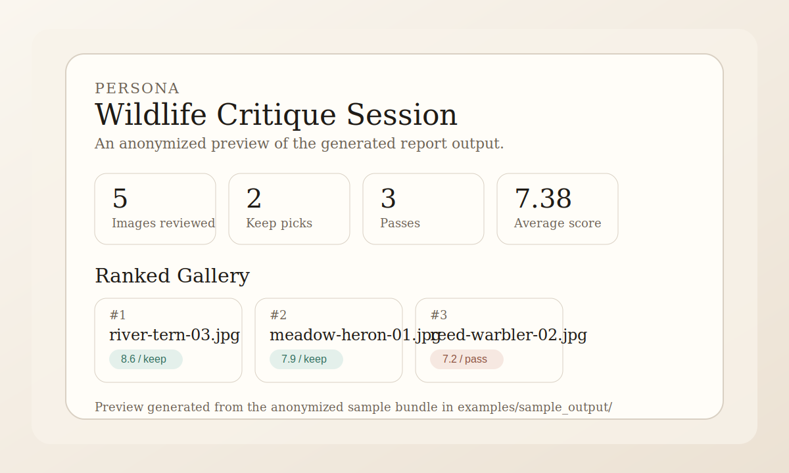

# Photo Critique Agent

Local-first CLI for reviewing folders of JPEG images with persona-driven critique output, ranked reports, and optional artist-influence guidance.

It is currently optimized for local experimentation and workflow design: ingest a folder of photos, inspect EXIF and CSV metadata, run a persona-specific critique pass, and generate JSON, Markdown, and HTML reports you can review or share.

## What It Does

- Inspects JPEG folders and normalizes metadata into a stable asset payload
- Analyzes image sets with photography personas like `wildlife`, `travel`, `street`, and `documentary`
- Generates ranked session outputs in JSON, Markdown, and HTML
- Supports an optional `--style` lens for influence-study critique such as `Saul Leiter`
- Keeps generated output local by default so real photo metadata is not committed accidentally

## Current Scope

This initial scaffold includes:

- A CLI entrypoint named `photo-critique`
- Core Pydantic models for jobs, personas, photos, and reports
- Bundled YAML persona support with personas including `wildlife`, `travel`, `street`, and more
- A placeholder Jinja2 Markdown template
- Unit tests covering the core models and persona loading

The current implementation includes a deterministic first-pass critique pipeline based on metadata only. Actual vision-model evaluation is still deferred.

## Quick Start

```bash
python -m venv .venv
source .venv/bin/activate
pip install -e ".[dev]"

photo-critique inspect ./photos
photo-critique analyze ./photos --persona wildlife
photo-critique analyze ./photos --persona street --style "Saul Leiter"
```

## Setup

```bash
python -m venv .venv
source .venv/bin/activate
pip install -e ".[dev]"
```

## Usage

Validate inputs for a critique job:

```bash
photo-critique ./photos --persona wildlife
```

Include supplemental metadata:

```bash
photo-critique ./photos --metadata-csv ./metadata.csv --persona wildlife
```

Inspect a folder of JPEGs, merge optional CSV metadata, and write normalized assets to `output/assets.json`:

```bash
photo-critique inspect ./photos
photo-critique inspect ./photos --metadata ./metadata.csv
```

The inspect command prints a short summary, extracts EXIF metadata when available, and normalizes each discovered image into a `PhotoAsset` payload.

Analyze a folder with the placeholder evaluator and a bundled persona:

```bash
photo-critique analyze ./photos --persona wildlife
photo-critique analyze ./photos --metadata ./metadata.csv --persona wildlife
photo-critique analyze ./photos --persona street --style "Saul Leiter"
```

The analyze command loads the selected YAML persona, runs a deterministic metadata-based evaluator, and writes a local output bundle. An optional `--style` lens can nudge the critique language toward a named artist or visual influence without changing the underlying persona schema:

- `output/results.json`
- `output/critique_report.md`
- `output/critique_report.html`

Open `output/critique_report.html` directly in a browser for a simple local demo.

## Sample Report Preview



You can inspect the committed anonymized examples here:

- `examples/sample_output/results.json`
- `examples/sample_output/critique_report.md`
- `examples/sample_output/critique_report.html`
- `examples/sample_output/assets.json`

## Style Lens Guidance

The `--style` option is intended as an influence-study aid, not an impersonation feature.

- Use it to ask how a frame might be strengthened toward the visual priorities associated with a historical body of work.
- Do not interpret the output as a literal simulation, endorsement, or first-person critique from a living or historical artist.
- The CLI validates `--style` as a short plain-text label so reports stay predictable and safe to render in local Markdown and HTML output.

Generated files under `output/` are intentionally ignored by git so local image metadata and file paths do not get committed by accident.

## Project Layout

```text
src/photo_critique_agent/
  cli.py
  models/
  personas/
  templates/
tests/
```

## Roadmap

Near term:

- Improve critique quality so personas feel more distinct and less repetitive
- Run larger real-world folder tests and tighten output ergonomics based on those sessions
- Add stronger benchmark fixtures for regression testing and ranking evaluation

Next stage:

- Introduce real image understanding instead of metadata-only critique
- Add better session management and configurable output destinations
- Expand persona/style behavior without turning style guidance into artist impersonation

Longer term:

- Package a smoother install and onboarding flow
- Consider a lightweight UI once the CLI workflow feels stable
- Add repeatable evaluation datasets for ranking and critique usefulness

## Testing

```bash
pytest
```
